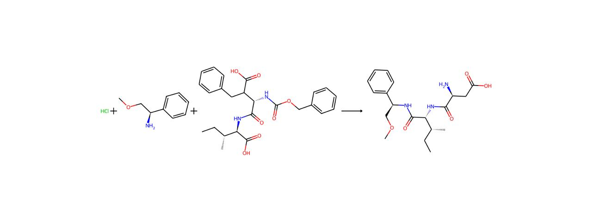

### Топалиди Александра Валерьевна 412479

### Тема проекта: разведочный анализ некоторого набора данных.

# Yields Predictions

Работа с данными отражена в блокноте, вы можете найти его здесь: 

```sh
data/data.ipynb
```

## Описание:

Над данным проектом мы работали в команде в составе 4х человек: 2 специалиста в области химиии, ML Engineer и я в качестве Data Scientist. Моей задачей было найти данные, очистить их, подготовить датасет для обучения модели. В данном README будет описана моя часть работы. 

**Цель нашего проекта** - научиться предсказывать выходы химических реакций по данным, которые можно найти в открытом доступе. 

На данный момент большинство реакций в открытых датасетах представлены в формате SMILES, так что мы выбрали данное представление для экспериментов с предсказаниями. 

В ходе проекта работали с двумя самыми крупными базами данных, находящимися в открытом доступе: 

```sh
ORD https://open-reaction-database.org/
USPTO https://www.uspto.gov/ 
```

По итогам работы с данными источниками мы собрали почищенный датасет из более 600 тысяч реакций, в котором имеются 2 колонки: SMILES и Yields.
Также, в процессе классификации мы добавляли в датасет еще 50 тысяч реакций из State of Art датасета USPTO-50k, в котором имеется третий столбец- один из 10 классов реакции. На основе которого мы пытались классифицировать реакции. Затем, в процессе работы над кластеризацией, данный столбец был удален. 

Наш очищенный датасет назодится тут:

```sh
data/combined_dataset_final.csv.zip
```

USPTO-50k:

```sh
data/class_train.csv
```

Презентация проекта доступна по адресу:

```sh
https://docs.google.com/presentation/d/1hnrGc3LZklYWVU1Rk8dheLg5EjzEvzBb6xPYzr5gzUo/edit?usp=sharing
```

# Работа с данными велась в двух направлениях:

## 1. **Классификация химических реакций**

- **Методы**:
    - `Logistic Regression`, `Random Forest`, `SVM`, `KNN`.
     - Ансамблевые методы, такие как градиентный бустинг.
- **Шаги**:
    1. **Разделение данных на тренировочную и тестовую выборки**.
        ```python
        from sklearn.model_selection import train_test_split
        X_train, X_test, y_train, y_test = train_test_split(X, y, test_size=0.3, random_state=42)
        ```
    2. **Обучение модели на тренировочных данных**.
        ```python
        from sklearn.ensemble import RandomForestClassifier
            
        model = RandomForestClassifier(n_estimators=100, random_state=42)
        model.fit(X_train, y_train)
        ```
    3. **Оценка модели на тестовых данных**: использование метрик, таких как accuracy, precision, recall, F1-score.
        ```python
        from sklearn.metrics import classification_report
            
        y_pred = model.predict(X_test)
        print(classification_report(y_test, y_pred))
        ```
    4. **Подбор гиперпараметров**: с использованием GridSearchCV или RandomizedSearchCV для улучшения модели.
        ```python
        from sklearn.model_selection import GridSearchCV
            
        param_grid = {
            'n_estimators': [50, 100, 200],
            'max_depth': [None, 10, 20, 30],
            'min_samples_split': [2, 5, 10]
        }
        grid_search = GridSearchCV(estimator=model, param_grid=param_grid, cv=5, n_jobs=-1, verbose=2)
        grid_search.fit(X_train, y_train)
        ```
    5. **Визуализация важности признаков**: и результатов классификации.
        ```python
        importances = model.feature_importances_
        indices = np.argsort(importances)[::-1]
        plt.figure(figsize=(12, 6))
        plt.title("Feature importances")
        plt.bar(range(X.shape[1]), importances[indices], align="center")
        plt.xticks(range(X.shape[1]), indices)
        plt.xlim([-1, X.shape[1]])
        plt.show()
        ```

## 2. **Кластеризация химических реакций**

 **Использовались следующие методы**:
- **`KMeans`:** основной метод для разбиения данных на кластеры.
- **Другие методы: `DBSCAN`, `AgglomerativeClustering`** (метрики были хуже)

- **Шаги**:
    1. **Стандартизация данных**: нормализация признаков для обеспечения равного вклада в результат.
        ```python
        from sklearn.preprocessing import StandardScaler
        scaler = StandardScaler()
        data_scaled = scaler.fit_transform(data)
        ```
    2. **Определение оптимального числа кластеров**: с помощью метода локтя (Elbow Method) и силуэтного анализа (Silhouette Score).
        ```python
        from sklearn.cluster import KMeans
        import matplotlib.pyplot as plt
            
        inertia = []
        for k in range(1, 11):
            kmeans = KMeans(n_clusters=k, random_state=42)
            kmeans.fit(data_scaled)
            inertia.append(kmeans.inertia_)
            
        plt.plot(range(1, 11), inertia, marker='o')
        plt.xlabel('Количество кластеров')
        plt.ylabel('Inertia')
        plt.show()
        ```
    3. **Применение алгоритма кластеризации**.
        ```python
        kmeans = KMeans(n_clusters=3, random_state=42)
        clusters = kmeans.fit_predict(data_scaled)
        ```
    4. **Визуализация результатов**: построение 2D и 3D графиков для визуализации кластеров.
         ```python
        import seaborn as sns
        sns.scatterplot(x=data_scaled[:, 0], y=data_scaled[:, 1], hue=clusters, palette='viridis')
        plt.show()
        ```
    5. **Оценка качества кластеризации**: с помощью метрик, таких как силуэтный коэффициент, индекс Калинского-Харабаза и индекс Дэвиса-Болдина.
        ```python
        from sklearn.metrics import silhouette_score, calinski_harabasz_score, davies_bouldin_score
            
        silhouette_avg = silhouette_score(data_scaled, clusters)
        ch_score = calinski_harabasz_score(data_scaled, clusters)
        db_score = davies_bouldin_score(data_scaled, clusters)
            
        print(f"The average silhouette_score is : {silhouette_avg}")
        print(f"The Calinski-Harabasz Index is: {ch_score}")
        print(f"The Davies-Bouldin Index is: {db_score}")
        ```

В ходе данной работы мы создали таблицу с метриками кластеризаций. Она доступна тут:

```sh
Metrics_for_clastering.pdf
```

Также, мы создали веб- страницу, на которой в кластерах отображались реакции. Далее, специалисты в области химии вручную смотрели полученные кластера, чтобы найти общее в кластеризованных объектах. Данная страница доступна тут:

```sh
index.html
```
Вот пример такого отображения: 



Примечание: на данный момент анализ проведен и реакции удалены из S3, так что они отображаться не будут.

## Вся работа с данными отражена в ноутбуке и лежит тут :

```sh
data/data.ipynb
```

Также, мы проводили работу с эмбеддингами, она доступка в блокноте

```sh
embeddings/predictor_yieldBERT.ipynb
```
На данный момент после множества экспериментов мы пришли к выводу, что для предсказаний лучше всего работают fingerprints. На эту тему мы пишем статью с названием "Are molecular fingerprints the best predictors of chemical reaction yields?"
